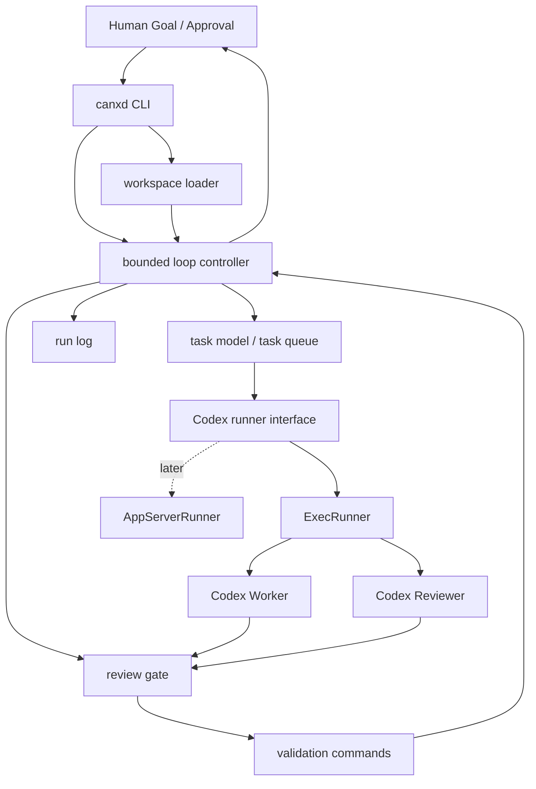
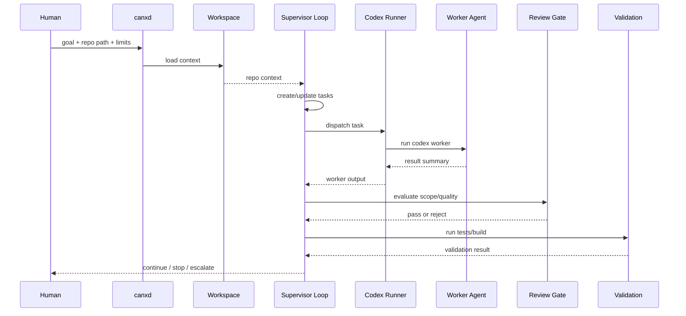

# CanX MVP Design

**Date:** 2026-03-17
**Status:** approved in chat

## Goal

Build a local single-machine orchestrator that coordinates multiple Codex workers to deliver bounded software-development loops against a target repository.

## Product framing

`CanX` is not a new agent framework and not a replacement for Codex. It is a thin `Go` supervisor layer that:

- reads repository context
- decomposes a goal into bounded tasks
- dispatches Codex workers
- runs review and validation gates
- decides whether to continue, stop, or escalate

The core problem it solves is that single-agent development remains too human-centric and too slow for larger projects. `CanX` shifts the default from one long human-agent conversation to an AI-to-AI delivery loop with bounded, reviewable steps.

## Scope

### In scope for MVP

- local single-machine orchestration
- one supervisor role
- multiple worker invocations
- bounded execution loop
- repository context loading
- review gate
- validation command execution
- run logging
- dual integration interface with `exec` first and `app-server` reserved

### Out of scope for MVP

- distributed execution
- complex UI
- generalized workflow automation beyond coding tasks
- uncontrolled infinite loops
- rebuilding generic model runtimes

## Architecture

### Core modules

- `cmd/canxd`
  - CLI entrypoint
- `internal/workspace`
  - loads target repository context from `README.md`, `AGENTS.md`, and selected docs
- `internal/tasks`
  - defines task model, status, ownership, and dependency metadata
- `internal/codex`
  - defines the `Runner` interface
  - first implementation is `ExecRunner`
  - future implementation is `AppServerRunner`
- `internal/loop`
  - bounded supervisor loop
- `internal/review`
  - review and gate decisions
- `internal/runlog`
  - stores summaries, outcomes, and failure reasons

### Design principle

The repository should own orchestration, not the full agent runtime. Existing Codex surfaces remain the execution engine; `CanX` only adds control, structure, and repeatability.

## Runner strategy

### Chosen approach

Support two runner types at the interface level:

- `ExecRunner` for MVP
- `AppServerRunner` later

Default to `ExecRunner` in the first release because it is the fastest way to get a useful local orchestrator running.

### Why not app-server first

- more protocol work upfront
- slower path to a usable MVP
- not necessary to prove the workflow model

### Why not exec-only

- risks hard-coding around a short-term transport
- would force unnecessary refactoring later

## Loop model

Each loop must be bounded and explicit.

### Inputs

- target repository path
- high-level goal
- max turns
- time budget
- validation commands

### Per-turn phases

1. load or refresh workspace context
2. supervisor defines or updates task list
3. dispatch one or more worker tasks
4. collect worker outputs
5. run review gate
6. run validation commands
7. decide continue, stop, or escalate

### Stop conditions

- all tasks complete and validations pass
- max turns reached
- time budget exceeded
- repeated review or validation failures
- human decision required

## Task model

Each task should be small and explicit.

Recommended fields:

- `id`
- `title`
- `goal`
- `status`
- `owner`
- `files_in_scope`
- `blocked_by`
- `validation_commands`
- `summary`

## Review gate

The review gate should remain lightweight in MVP.

Checks:

- task stayed in scope
- task respected repository rules
- required tests or validation commands were run
- output is actionable enough for the next step

The first version can be rule-based and text-oriented; it does not need a complicated policy engine.

## Workspace loading

The first repository context pass should load:

- `README.md`
- `AGENTS.md`
- a small number of high-signal docs under `docs/`

This keeps worker prompts short while preserving intent.

## Run logging

Each loop should record:

- goal
- selected tasks
- worker assignments
- validation commands
- review results
- final decision per turn

This creates durable memory without relying on long prompt history.

## MVP implementation order

1. define task and loop models
2. define `Runner` interface
3. implement `ExecRunner`
4. implement workspace context loader
5. implement review gate
6. wire `canxd` into a minimal end-to-end loop

## Success criteria

The MVP is successful when `CanX` can:

- read a target repository
- accept a high-level goal
- create a small bounded task set
- dispatch Codex through `exec`
- run validation commands
- produce a clear stop/continue decision

## References

- Requirements: `docs/2026-03-17-requirements.md`
- Context: `docs/2026-03-17-project-context.md`
- Landscape: `docs/research/2026-03-17-orchestrator-landscape.md`
