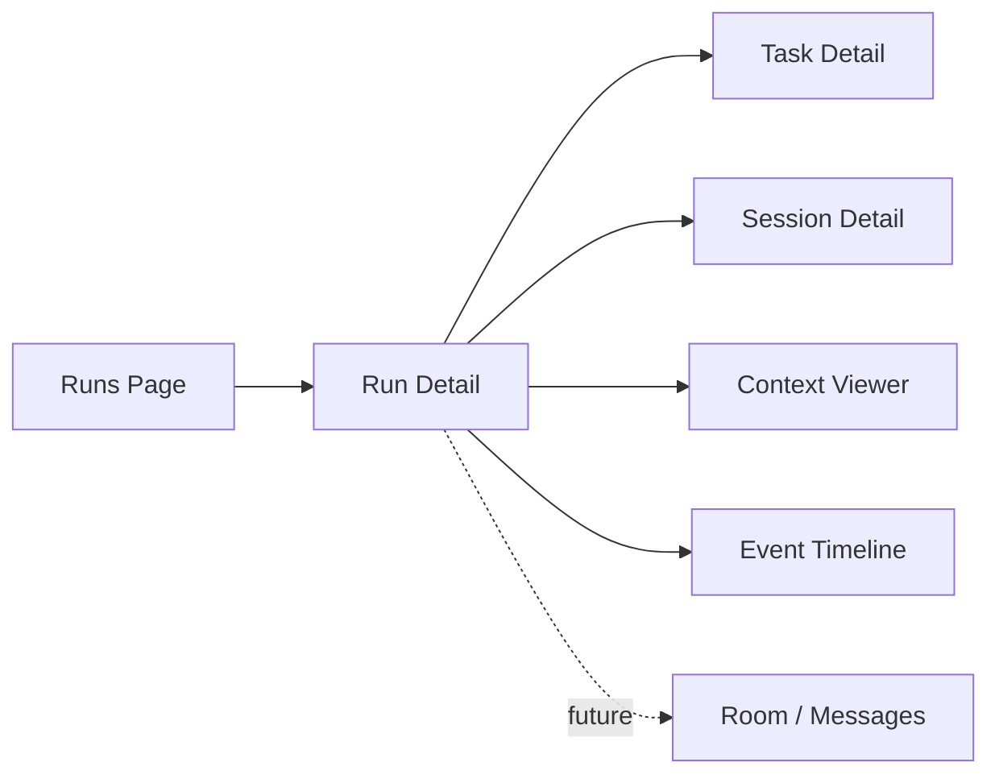
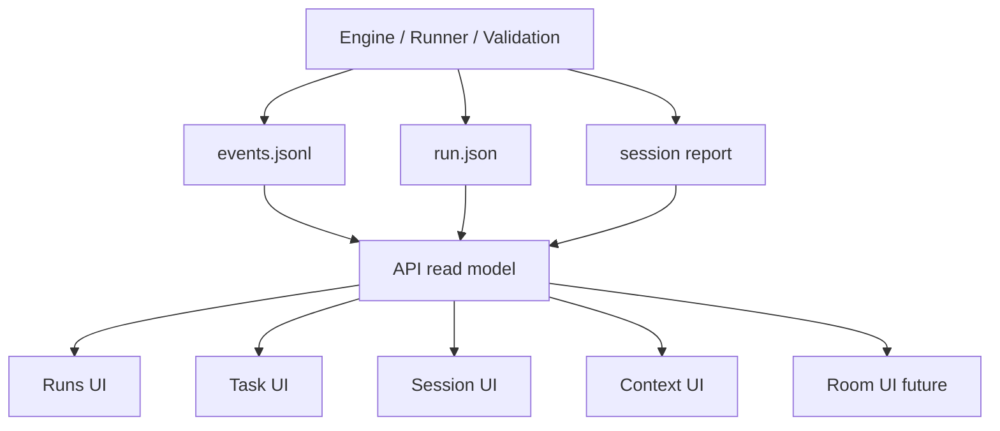

# CanX UI Observability Design

**Date:** 2026-03-19

## Goal

为 `CanX` 增加一个实战可用的本地 UI，让人类和 agent 都能直接看到：

- 当前所有 `run`
- 每个 `task` 的状态与进度
- 每个 `session` 的 runtime 信息
- 每一轮 `turn` 的上下文、输出、验证结果
- 仓库级上下文文件，例如 `README.md`、`AGENTS.md`、关键 `docs`
- 后续的人类/agent 协作消息入口

UI 的目标不是“好看”，而是让调试、追踪、接管、继续执行变得直接。

## Product requirements

### 1. Global dashboard

首页必须能回答：

- 当前有哪些 run 在运行
- 哪些 run 已停止 / escalated / failed
- 每个 run 下有多少 task
- 哪些 task 卡住了
- 哪些 worker/session 在活跃

### 2. Task detail

点击 task 后必须能看到：

- `task_id`
- title / goal
- 当前状态
- 关联 `run_id`
- 关联 `session_id`
- 最近一次输出
- 最近一次 validation / review
- 原始 event stream

### 3. Session detail

点击 session 后必须能看到：

- `runtime_session`
- `model`
- `provider`
- `sandbox`
- `approval`
- turns 列表
- turn 的 prompt 摘要
- turn 的原始输出

### 4. Repo context view

UI 必须能查看当前 repo 的高信号上下文：

- `README.md`
- `AGENTS.md`
- `docs/README.md`（如果存在）
- 最新 spec / plan
- 当前 run 实际读取了哪些 docs

这点很关键，因为很多错误来自“agent 读了什么”和“没读什么”。

### 5. Collaboration entry

UI 后续必须能支持：

- human comment
- human instruction
- reviewer feedback
- task reassignment
- room/thread view

第一阶段不一定要完整实现消息发送，但 UI 设计必须预留入口。

## Design principles

- 先做本地单机，不做复杂权限系统
- 先做读侧，写侧最小化
- 所有页面都基于统一事件模型，不做散落状态
- 人和 agent 看的是同一套事实来源
- 结构优先于样式

## Data model

### Core objects

- `Run`
- `Task`
- `Session`
- `Turn`
- `Event`
- `Room`（后续）
- `Message`（后续）

### Existing persisted sources

当前已有：

- `.canx/runs/<run-id>/run.json`
- `.canx/runs/<run-id>/events.jsonl`
- `.canx/sessions/<session-id>.json`

### Additional read models to add

为了让 UI 更快，不必每次全量重放：

- `run index`
- `session index`
- `task index`

但第一阶段可以先不做索引，直接从 run 文件夹扫描。

## Proposed screens

### Screen 1: Runs

展示：

- run 列表
- 状态过滤：`running / stop / escalate / failed`
- 排序：最新优先
- summary：goal、duration、turns、tasks、reason

### Screen 2: Run detail

展示：

- run 概览
- task 列表
- session 列表
- event timeline
- 当前 repo context summary

### Screen 3: Task detail

展示：

- task metadata
- 当前状态
- 所属 run
- 所属 session
- 相关 turn
- validation/review 结果
- task 相关消息（未来 room/message）

### Screen 4: Session detail

展示：

- runtime metadata
- turns
- prompt summary
- raw output
- validation output
- token/cost 字段（未来）

### Screen 5: Context viewer

展示：

- `README.md`
- `AGENTS.md`
- docs 列表
- “本 run 使用过的 docs”

这部分能直接帮助人类判断 agent 是否读对了材料。

## Minimal information architecture

## Event-driven UI model

UI 不直接拼接各种 JSON 文件，而是统一走读模型：

## API shape

### Already present

- `GET /api/runs`
- `GET /api/runs/:id`
- `GET /api/runs/:id/events`

### Next endpoints

- `GET /api/sessions`
- `GET /api/sessions/:id`
- `GET /api/tasks/:id`
- `GET /api/context`
- `GET /api/context/docs`

### Future collaboration endpoints

- `GET /api/rooms`
- `GET /api/rooms/:id`
- `GET /api/rooms/:id/messages`
- `POST /api/rooms/:id/messages`

## OpenClaw / ACP / Codex lessons to reuse

### OpenClaw

借用：

- 每个 agent 是独立 participant
- routing 和 binding 是显式的
- 不默认把一条消息广播给所有 agent

UI 启发：

- 必须清楚显示“哪个 agent / session 正在处理哪个 task”

### ACP

借用：

- session 是一等公民
- message / event 应统一建模
- await / resume 是必要能力

UI 启发：

- 要能看到“系统在等什么”
- escalated / blocked 不能只是一个最终 reason，要能看到等待对象

### Codex app-server

借用：

- thread / turn 分层
- streaming delta
- completed event

UI 启发：

- 应支持 turn timeline
- 应支持未来的实时流式输出

## MVP implementation order

### Phase 1: Read-only observability

目标：

- runs page
- run detail
- task list
- raw events
- session metadata

这部分现在已经开始有基础，可继续补：

- task detail
- session detail
- context viewer

### Phase 2: Context visibility

目标：

- 展示 `AGENTS.md`
- 展示 docs 索引
- 展示 latest spec/plan
- 展示 run 实际使用的 docs

### Phase 3: Collaboration room

目标：

- room list
- message list
- human instruction input
- agent/reviewer messages

### Phase 4: Live stream

目标：

- SSE 或 WebSocket
- 实时 delta
- 实时 task 状态变化

## Practical recommendation

当前最该做的是：

1. 补 `task detail`
2. 补 `session detail`
3. 补 `context viewer`
4. 再加 `room/message`

不要先做复杂前端框架迁移，也不要先做权限系统。

## Bottom line

`CanX` 的 UI 不应只是一个结果页面。它应该是一个本地控制台，回答三个问题：

1. **现在系统在做什么**
2. **为什么停在这里**
3. **人或其他 agent 下一步该接什么**

只要这三点能看清，`CanX` 才能从“loop runner”变成实战可用的多 agent 开发台。
