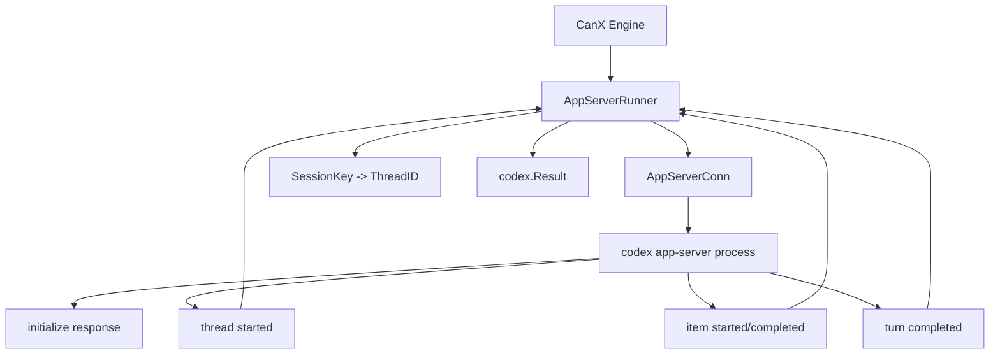

# CanX AppServerRunner Design

**Date:** 2026-03-20

## Goal

为 `CanX` 增加一个最小可用的 `AppServerRunner`，替换当前每轮 `codex exec -` 启动新进程的模式，让 task 可以复用持久 thread/session。

第一版目标非常明确：

- 支持 `codex app-server`
- 支持 `approval=never`
- 支持同一 task 在多轮之间复用同一个 app-server thread
- 保持 `CanX` 现有 `Runner` 接口和 scheduler 控制流基本不变

## Non-goals

- 不做 interactive approval
- 不做 UI 实时 delta streaming
- 不做跨进程 daemon 化的 app-server 管理
- 不做复杂 reconnect / crash recovery
- 不改变 `Engine` 的高层调度结构

## Why This Matters

当前 `ExecRunner` 的主要问题不是“能不能调用 Codex”，而是：

- 每轮都会 fork 新进程
- 上下文无法原生跨 turn 持续保留
- 并发 worker 虽然已有，但每个 worker 都还在做短生命周期 subprocess 调用

对于刚实现的多 worker scheduler，这意味着：

- task 拆得越细，重复上下文成本越高
- 动态 spawn 后 child task 无法获得真正稳定的 thread 生命周期

`AppServerRunner` 的价值就是把 `CanX` 从“调度多次独立调用”提升成“调度多个持久 worker thread”。

## Chosen Scope

第一版只做最小稳定链路：

1. 启动一个长生命周期 `codex app-server` 子进程
2. 完成 `initialize` 握手
3. 为每个 `SessionKey` 映射一个 thread
4. 发送 `thread/start` 与 `turn/start`
5. 收集 `item`/`turn` 完成事件
6. 聚合为现有 `codex.Result`

不处理：

- `approval.requested` 之类的交互事件
- UI 侧流式展示
- 复杂 item 类型的全量暴露

## API Compatibility

保持 `codex.Runner` 接口不变：

```go
type Runner interface {
    Run(ctx context.Context, req Request) (Result, error)
}
```

但扩展 `codex.Request` 一个可选字段：

```go
type Request struct {
    Prompt     string
    Workdir    string
    MaxTurns   int
    SessionKey string
}
```

用途：

- `SessionKey` 由上层 scheduler 传入
- `AppServerRunner` 用它稳定映射 thread
- `ExecRunner` 忽略它，保持兼容

这能避免把 thread 复用逻辑硬编码在 runner 内部推断。

## Architecture

建议拆成三层，但第一版只实现最小功能：

### 1. AppServer Protocol Layer

文件：

- `internal/codex/appserver_protocol.go`

职责：

- 定义 JSON-RPC request/response/notification 结构
- 定义 `initialize`、`thread/start`、`turn/start` 的 payload struct
- 定义需要消费的通知类型

### 2. AppServer Connection Layer

文件：

- `internal/codex/appserver_conn.go`

职责：

- 启动 `codex app-server` 子进程
- 管理 stdin/stdout
- 维护 JSON-RPC request id
- 将 response 与 request 对上
- 将 server notification 分发给等待中的调用方

第一版不做复杂总线，只做：

- 单连接
- 并发安全
- 基本通知分发

### 3. AppServer Runner Layer

文件：

- `internal/codex/appserver_runner.go`

职责：

- 实现 `Runner`
- 维护 `SessionKey -> threadID` 映射
- 在首次调用时创建 thread
- 在后续调用时复用 thread
- 聚合 turn 结果为 `Result`

## Data Flow



## Runner Lifecycle

### Initialization

首次使用 `AppServerRunner` 时：

1. 启动 `codex app-server`
2. 发送 `initialize`
3. 记录 server capabilities/version

这个过程应只发生一次。

### Per SessionKey

如果 `SessionKey` 还没有绑定 thread：

1. 发送 `thread/start`
2. 接收 `thread/started`
3. 缓存 `SessionKey -> ThreadID`

如果已存在映射：

- 直接复用已有 thread

### Per Run

`Run(ctx, req)` 中：

1. 确保连接初始化完成
2. 确保 `SessionKey` 对应 thread 已存在
3. 发送 `turn/start`
4. 收集当前 turn 的 item/turn 完成通知
5. 聚合最终输出
6. 返回 `codex.Result`

## Output Aggregation

第一版聚合策略保持朴素：

- 优先取 turn 完成后的最终 assistant text
- 如果没有明确的最终文本，则拼接完成的 text item
- runtime 元数据尽可能从 initialize / turn metadata 中提取

目标不是暴露完整 item 树，而是保持与当前 `ExecRunner` 行为兼容：

```go
type Result struct {
    Output   string
    ExitCode int
    Runtime  Runtime
}
```

## Concurrency Model

一个 `AppServerRunner` 内允许：

- 多个 goroutine 并发 `Run`
- 每个 `SessionKey` 独立映射到自己的 thread

但要求：

- JSON-RPC 写入串行化
- response correlation 正确
- 某个 `SessionKey` 的同一时刻只允许一个 active turn

这和当前 scheduler 设计一致：

- 一个 task 一次只由一个 worker scope 持有
- 并发来自多个 task，不来自同一 task 的并发 turn

## Error Handling

### App Server Startup Failure

- 直接返回 `RunError`
- 不做自动 fallback 到 `ExecRunner`

理由：

- fallback 会掩盖配置问题
- 用户需要明确知道当前实际走的是哪条链路

### Protocol Failure

- JSON decode 失败、response 超时、缺少 thread/turn completion 时直接报错
- 第一版不做自动 reconnect

### Unsupported Approval Flow

如果收到需要人工审批或工具批准的事件：

- 第一版直接报错，提示只支持 `approval=never`

这是有意为之，避免做半套 approval 逻辑。

## CLI Integration

当前 `cmd/canxd` 已有：

- `-runner exec`
- `-runner mock`

建议扩展为：

- `-runner exec`
- `-runner appserver`
- `-runner mock`

这样用户可以显式切换，不破坏当前默认值。

第一版可以暂时保持默认仍为 `exec`，等稳定后再考虑默认切换。

## Testing Strategy

重点不是“真的依赖本机 codex app-server 跑通”才能测试，而是：

1. 协议层结构序列化正确
2. 连接层请求-响应关联正确
3. runner 能基于 `SessionKey` 复用 thread
4. 并发 task 不会串 thread

### Focused tests

建议新增：

- `internal/codex/appserver_test.go`

覆盖：

- `initialize` 握手
- 同一个 `SessionKey` 两次 `Run()` 复用同一个 thread
- 两个不同 `SessionKey` 创建两个不同 thread
- 收到 approval-required 事件时返回明确错误

### Integration smoke

保留一个可选真实 smoke：

- 仅在本机有 `codex` 时执行
- 使用 `approval=never`
- 验证 `AppServerRunner` 能成功完成一轮 turn

## File Responsibilities

- `internal/codex/runner.go`
  - 扩展 `Request.SessionKey`
- `internal/codex/exec_runner.go`
  - 保持兼容，无需使用 `SessionKey`
- `internal/codex/appserver_protocol.go`
  - 协议模型与 JSON-RPC 类型
- `internal/codex/appserver_conn.go`
  - stdio 子进程 + request/response 管理
- `internal/codex/appserver_runner.go`
  - `Runner` 实现与 `SessionKey -> ThreadID` 复用
- `internal/codex/appserver_test.go`
  - fake protocol server 测试
- `cmd/canxd/main.go`
  - `-runner appserver` 接入

## Implementation Order

### Phase 1

- 扩 `codex.Request`，加入 `SessionKey`
- 新增协议 struct

### Phase 2

- 实现 `AppServerConn`
- 做 fake stdio server 协议测试

### Phase 3

- 实现 `AppServerRunner`
- 接入 `SessionKey -> ThreadID`

### Phase 4

- 在 `cmd/canxd` 暴露 `-runner appserver`
- 增加最小 smoke test

## Why This Is Not Wheel Reinvention

这个设计刻意避免重复造轮子：

- 不自建 agent runtime
- 不自建通用 JSON-RPC 协议
- 不自建 approval 系统
- 不替代 Codex Thread/Turn/Item 模型

CanX 只做自己该做的：

- 使用 Codex 原生 app-server 作为执行面
- 把 CanX 的 task scheduler 映射到持久 thread
- 继续保留 validation gate 和 bounded orchestration

## Success Criteria

第一版完成后，应满足：

1. `-runner appserver` 可以跑通基础任务。
2. 同一个 `SessionKey` 的多轮调用复用同一个 thread。
3. 不同 task 的并发调用不会串线。
4. 当前 scheduler 不需要为了 app-server 重写控制流。
5. 当遇到 approval 流时，系统会明确失败而不是静默行为错误。
