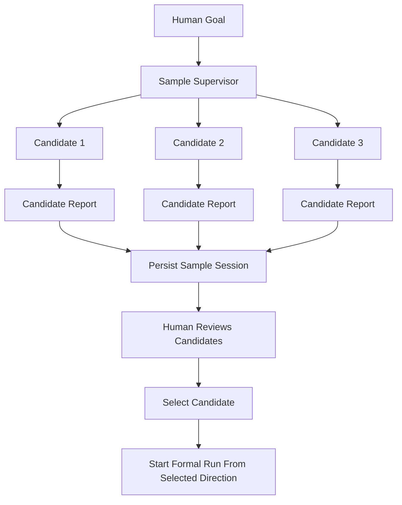

# CanX Branch Sampling Design

**Date:** 2026-03-20

## Goal

为 `CanX` 增加一种新的运行模式：**同一个人类 prompt 同时交给多个 agent 并行探索，由人类最终选择一个分支继续执行。**

第一版目标不是“多分支真实改代码”，而是更轻量的：

- 同一个 goal 并行启动多个候选 agent
- 所有候选 agent 在共享 workspace 上进行**只读/计划型探索**
- 每个候选 agent 输出自己的方案、总结、建议步骤
- `CanX` 持久化这些候选结果
- 人类从中选择一个分支继续进入正式执行

## Why This Matters

当前 `CanX` 已经支持：

- task-level 并行调度
- worker 动态 spawn
- validation gate
- app-server thread 复用

但还缺一个更上层的能力：

- **当问题本身不确定时，不是拆 task，而是并行探索多条“思路分支”。**

典型场景：

- 需求描述模糊，希望先看多个方案草图
- prompt 写法会显著影响结果，希望并行看不同候选
- 人类主观偏好很强，希望从多个 agent 输出里挑一个
- 早期探索阶段不应该直接让所有 agent 改代码

这类问题的最优解不是“让一个 agent 多想一点”，而是“让多个 agent 从同一起点自然分叉，再由人类筛选”。

## Non-goals

第一版明确不做：

- 不创建 git worktree
- 不让多个分支真实写代码
- 不做自动 merge
- 不做 AI 自动选优
- 不做复杂 branch genealogy 图

这些属于第二阶段。

## Terminology

- `Sampling Run`
  - 一次分支采样会话
- `Candidate`
  - 同一个 goal 下的一个候选 agent 分支
- `Selection`
  - 人类选择一个 candidate 继续推进

## Product Shape

### User Experience

第一版建议新增一个轻量 CLI 模式，例如：

```bash
go run ./cmd/canxd sample \
  -goal "设计 CanX 的某个功能方向" \
  -runner exec \
  -candidates 3 \
  -repo .
```

或复用现有入口加 flag：

```bash
go run ./cmd/canxd \
  -goal "设计 CanX 的某个功能方向" \
  -mode sample \
  -candidates 3 \
  -repo .
```

第一版更推荐子命令：

- `canxd sample`

原因：

- 与正式执行 run 的语义分开
- 避免把“采样探索”和“正式交付执行”混在一个入口里
- 便于后续扩展 `sample list/show/select`

## Chosen Scope

第一版范围：

1. 同一个 goal 启动 `N` 个候选 agent
2. 每个 candidate 都只执行只读 prompt
3. 候选 agent 不允许改文件
4. 结果持久化到 `.canx/samples/`
5. 支持查看候选输出
6. 支持人类选择一个 candidate，并把它转成后续正式 run 的起点信息

不做：

- worktree 隔离
- branch merge
- 对候选结果做自动评审排序

## Architecture

### High-Level Flow



### Separation From Current Scheduler

这个模式不应塞进当前 task scheduler。

原因：

- scheduler 解决的是“一个 run 内 task 如何推进”
- branch sampling 解决的是“是否先开多个独立候选 run”

因此应建成并列能力：

- `run`: 正式执行模式
- `sample`: 候选采样模式

## Candidate Model

第一版每个 candidate 至少包含：

```go
type SampleCandidate struct {
    ID          string
    Index       int
    Goal        string
    Prompt      string
    Output      string
    Summary     string
    Runtime     codex.Runtime
    Status      string
    StartedAt   time.Time
    FinishedAt  *time.Time
}
```

以及一个顶层 session：

```go
type SampleSession struct {
    ID          string
    Goal        string
    CandidateCount int
    Candidates  []SampleCandidate
    SelectedID  string
    StartedAt   time.Time
    FinishedAt  *time.Time
}
```

## Prompting Strategy

第一版不依赖复杂 prompt mutation。

基本策略：

- 所有 candidate 使用同一个 goal
- 在 system/prompt 中明确告知：
  - 这是 branch sampling 模式
  - 当前只做只读探索，不改文件
  - 输出应包含：
    - 方案摘要
    - 建议实施步骤
    - 风险/权衡

可选地加轻微扰动，但第一版不强求。

例如：

- candidate 1: “优先保守、最小改动”
- candidate 2: “优先长期结构”
- candidate 3: “优先最快落地”

但这属于增强项，第一版可先全部同 prompt。

## Persistence

建议持久化到：

```text
.canx/samples/<sample-id>/sample.json
.canx/samples/<sample-id>/candidates/<candidate-id>.md
```

规则：

- `sample.json` 存结构化元数据
- 每个 candidate 的原始输出单独落盘
- 方便 UI/CLI 展示与后续人工选择

## Human Selection Model

第一版选择可以先做简单 CLI：

```bash
go run ./cmd/canxd sample list
go run ./cmd/canxd sample show <sample-id>
go run ./cmd/canxd sample select <sample-id> <candidate-id>
```

`select` 的结果不是自动 merge 代码，而是：

- 把 `SelectedID` 写回 sample session
- 输出被选中 candidate 的总结
- 提示后续正式 run 可基于这个 candidate 的思路继续

未来可以扩展为：

- `sample continue <sample-id> <candidate-id>`

由 `CanX` 自动把 candidate summary 作为新 run 的前置上下文。

## Safety And Constraints

第一版必须加这些限制：

- 所有 candidate 运行在只读模式
- 默认不允许 `write` / `exec destructive`
- 默认 `MaxTurns = 1`
- 默认不做 validation gate

原因：

- branch sampling 阶段的目的不是交付代码
- 目标是低成本生成多个方向
- 避免多个候选并发写文件污染同一 workspace

## Comparison With Existing Parallel Scheduler

| 能力 | 当前 scheduler | branch sampling |
|---|---|---|
| 粒度 | task 级 | run / idea 级 |
| 目的 | 推进交付 | 探索候选分支 |
| 是否改代码 | 可以 | 第一版不可以 |
| 是否需要人类选择 | 不一定 | 必须 |
| 结果 | 完成任务 | 提供候选方案 |

## Phase Plan

### Phase 1: Read-only Candidate Sampling

交付：

- `sample` 子命令
- `N` 个只读 candidate 并行运行
- `.canx/samples/` 持久化
- `list/show/select`

### Phase 2: Guided Continuation

交付：

- 从被选中 candidate 继续正式 run
- 自动把 candidate summary 注入新 run prompt

### Phase 3: Worktree-backed Branch Sampling

交付：

- 每个 candidate 分配独立 worktree
- candidate 可真实改代码
- 人类选择一个 worktree 继续

这才是“多分叉真实演化”的完整版，但不该作为第一版起点。

## Implementation Notes

建议实现为新模块：

- `internal/sampling`
  - sample session model
  - candidate orchestration
  - persistence

CLI：

- `cmd/canxd/main.go`
  - 新增 `sample` 子命令

不要把它硬塞进 `internal/loop.Engine`。

## Testing Strategy

第一版测试重点：

1. `N` 个 candidate 会并行跑完
2. sample session 正确持久化
3. `list/show/select` CLI 工作正常
4. candidate 默认是只读 prompt，不进入写代码执行路径

优先使用 mock runner，不依赖真实 Codex。

## Why This Is Useful

这是一个很小但很实用的能力，因为它补的是：

- “在执行之前先分叉探索”

而不是：

- “把已有执行流程再复杂化”

它适合真实开发中的早期选择问题，也和你现在的使用方式一致：

- 人类先给一个 prompt
- 多个 agent 各自尝试
- 人类挑一个最想要的分支继续

## Success Criteria

第一版完成后，应满足：

1. 一个 goal 可以启动多个只读 candidate 并行探索。
2. 每个 candidate 的输出都会被持久化并可查看。
3. 人类可以明确选择一个 candidate。
4. 该能力不干扰现有正式执行 run。
5. 它为第二阶段的 worktree 分叉执行留下清晰升级路径。
