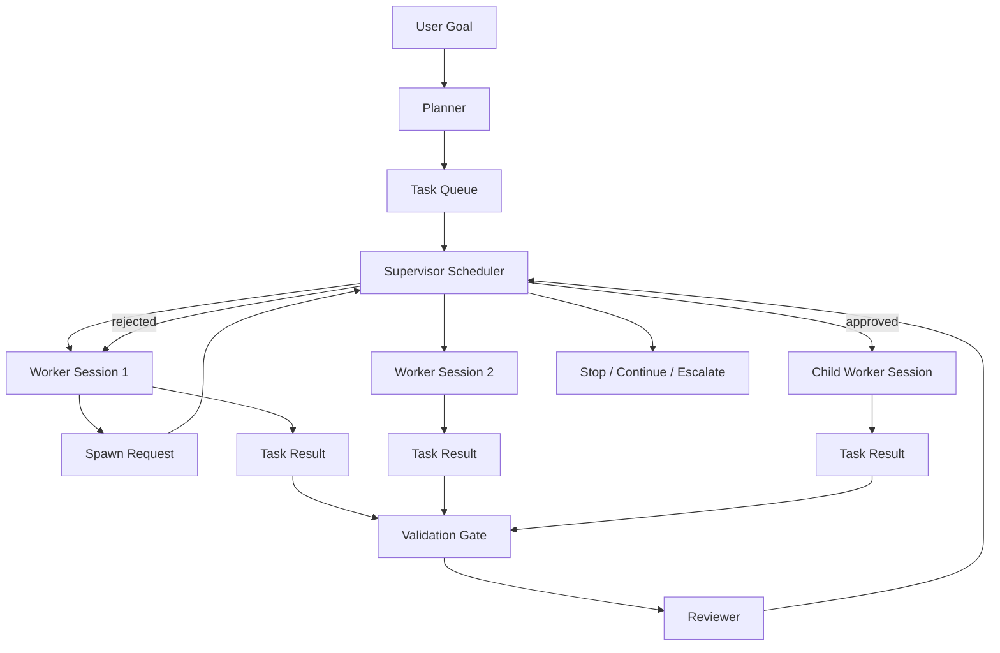

# CanX Multi-Codex Scheduler Design

**Date:** 2026-03-20

## Goal

让 `CanX` 真正补上 Codex 当前在软件交付场景里的短板：

- 并行能力弱
- 任务分裂能力弱
- 一个 worker 卡住时，无法把可并行工作可靠拆出去

本设计的目标不是做一个通用多 agent 框架，而是给 `CanX` 增加一个**对 Codex 友好的、多 worker 调度层**，让用户可以继续使用简单 CLI，同时获得：

- 初始 task 并行执行
- worker 运行中申请动态拆分子任务
- supervisor 统一调度和限流
- validation gate 仍然是一等公民

## Non-goals

- 不自建模型运行时
- 不自建通用 agent-to-agent 消息协议
- 不引入通用 DAG/图工作流引擎
- 不让 worker 之间直接互相对话
- 不把 CanX 做成 OpenClaw 那样的渠道/assistant 平台

## Product Positioning

CanX 的定位保持不变：

- `Codex` 负责单个 worker 的推理和执行
- `CanX` 负责何时拆分、何时并发、何时验证、何时停止或升级

换句话说，CanX 提供的是：

- deterministic scheduling
- bounded execution
- validation/review gate
- workspace-aware orchestration

而不是：

- 通用 agent runtime
- 聊天式多 agent 网络
- 另一个 LangGraph/OpenClaw

## User Experience

默认使用方式仍然保持简单：

```bash
canxd -goal "实现 X"
```

默认行为：

- 自动规划任务
- 默认允许初始 task 并行
- 默认允许 1 层动态 spawn
- 默认有文件冲突保护
- 默认保留 validation gate

需要时，用户可显式控制：

```bash
canxd \
  -goal "实现 X" \
  -planner codx \
  -max-workers 3 \
  -max-spawn-depth 1 \
  -validate "make test"
```

新增 CLI 参数建议：

- `-max-workers`
- `-max-spawn-depth`
- `-max-children-per-task`

这些参数都应有安全默认值，不要求用户理解复杂工作流模型。

## Chosen Approach

在三种实现路径中，选择：

- 静态 task 并行为基础
- worker 可发 `spawn request`
- 是否创建 child worker 一律由 supervisor 决定

不选择：

- 纯 goroutine 包装的轻补丁方案
- 先做复杂 agent 通信总线或图调度引擎

原因：

1. 静态并行是最快落地、最容易验证价值的能力。
2. 动态 spawn 是真实开发过程中的刚需，但必须由 supervisor 控制。
3. 该路径能平滑兼容未来 `AppServerRunner`，不会形成一次性架构。

## Architecture

### Roles

- `Planner`
  - 将用户目标拆成初始 tasks
- `Supervisor`
  - 唯一允许创建 worker 的角色
  - 负责并发配额、冲突判断、spawn 审批
- `Worker`
  - 执行 task
  - 可输出结构化 `spawn request`
- `Reviewer`
  - 保持现有最小 review/gate 模型

### Core Flow



### Scheduling Model

`Engine` 需要从“每轮只推进一个 active task”的顺序模型，升级为“小型 scheduler”：

- 维护 `pending/running/done/blocked` 任务池
- 在并发额度内调度可运行 task
- 为每个运行中的 task 绑定一个独立 worker session
- 收集 worker 输出后，统一进入 validation/review
- 基于结果更新 task 状态并决定是否继续调度

第一版不做任意图，只支持：

- 无依赖 task 可并发
- 有显式冲突的 task 不并发
- parent-child task 层级最多一层动态扩展

## Data Model Changes

### Config

建议在 `loop.Config` 增加：

```go
type Config struct {
    Goal                 string
    MaxTurns             int
    BudgetSeconds        int
    ValidationCommands   []string
    MaxWorkers           int
    MaxSpawnDepth        int
    MaxChildrenPerTask   int
}
```

默认值建议：

- `MaxWorkers = 2`
- `MaxSpawnDepth = 1`
- `MaxChildrenPerTask = 2`

### Task

建议在 `tasks.Task` 增加：

```go
type Task struct {
    ID              string
    Title           string
    Goal            string
    Status          string
    ParentTaskID    string
    SpawnDepth      int
    OwnerSessionID  string
    DependsOn       []string
    PlannedFiles    []string
    Summary         string
    FilesChanged    []string
}
```

说明：

- `ParentTaskID`：标识 child task 来源
- `SpawnDepth`：执行时限制层数
- `OwnerSessionID`：当前 task 由哪个 worker session 负责
- `PlannedFiles`：用于粗粒度文件冲突判断

## Structured Control Protocol

第一版不引入新协议层，只扩展现有 marker 语义。

### Stop Result

```text
[canx:stop:{"summary":"implemented retry logic","files_changed":["internal/loop/engine.go"],"status":"done"}]
```

### Spawn Request

```text
[canx:spawn:{"title":"Add regression test","goal":"write a failing regression test for retry logic","reason":"can run in parallel with implementation","planned_files":["internal/loop/engine_test.go"]}]
```

### Supervisor Handling Rules

- `stop`:
  - 解析结构化结果
  - 写入 task summary/files_changed
  - 继续 validation/review
- `spawn`:
  - 仅视为请求，不自动生效
  - 由 supervisor 检查：
    - 当前 `SpawnDepth`
    - 当前 child 数量
    - 当前 worker 并发额度
    - `planned_files` 是否与活跃 task 冲突
  - 通过后创建 child task 和 child worker
  - 拒绝则把原因反馈给父 task 的下一轮 prompt

## Conflict Control

第一版采用粗粒度文件级冲突控制，不做 AST 或 diff 级分析。

规则：

- worker 或 planner 应尽量声明 `planned_files`
- 两个活跃 task 的 `planned_files` 交集非空时，不能并发
- 未声明 `planned_files` 的 task 默认视为高风险，优先顺序执行

这是保守策略，但更符合第一版“真的能用”的要求。

## Session and Runner Model

每个运行中 task 对应一个独立 worker session。

第一版继续复用现有 `codex.Runner` 抽象：

- `ExecRunner` 仍可作为默认实现
- 未来替换为 `AppServerRunner` 时，scheduler 控制流不变

这样避免重复造 runtime，同时给后续 thread 持久化预留接口。

## Eventing and Observability

需要把 parent-child 和并发调度写入现有 runlog：

- `task_spawn_requested`
- `task_spawn_approved`
- `task_spawn_rejected`
- `task_started`
- `task_completed`
- `task_blocked`

并在 `RunRecord` / `SessionReport` 中体现：

- task 的 `parent_task_id`
- task 的 `owner_session_id`
- child task 数量
- 当前并发 worker 数

UI 第一版无需复杂交互，但至少应能看到：

- 哪些 task 在并发运行
- 哪个 task 是哪个 parent 派生出来的
- spawn 请求是否被拒绝及原因

## Error Handling

### Validation Failure

- task 不标记完成
- validation 输出回灌给该 task 的下一轮 prompt
- 如果已有 child task 完成，其 summary 仍保留给父 task 参考

### Spawn Rejection

- 不终止父 task
- 拒绝原因写入父 task 下一轮 prompt
- 常见原因：
  - 超过 `MaxSpawnDepth`
  - 超过 `MaxChildrenPerTask`
  - 超过 `MaxWorkers`
  - 文件冲突

### Worker Failure

- 如果输出中有合法 `stop/spawn` marker，则按部分成功处理
- 否则按当前 task 执行失败处理
- 达到 turn/budget 限制时走 `escalate`

## Testing Strategy

优先做 focused tests，再跑全量测试。

第一版至少覆盖：

1. planner 生成多个独立 task 时可并发调度
2. 文件冲突 task 不会同时运行
3. worker 发出合法 `spawn request` 后，supervisor 能创建 child task
4. 超过 `MaxSpawnDepth` 时，spawn 被拒绝
5. child task 完成后，结构化结果回写到 parent 可消费状态
6. validation 失败时不会误判 task 完成
7. runlog/session report 正确记录 parent-child 关系

建议优先增加：

- `internal/loop` 调度测试
- `evals/agentic` 并行/动态 spawn smoke case
- `cmd/canxd` CLI 参数测试

## Implementation Order

### Phase 1

- 扩 `Config` 与 `Task` 数据结构
- 补结构化 `spawn` marker 解析
- 先让 `Engine` 能并发跑初始 task

### Phase 2

- 加入 `spawn request -> supervisor approval -> child task`
- 增加文件冲突控制
- 增加 runlog parent-child 事件

### Phase 3

- 在 UI 中展示 task 并发与 parent-child 关系
- 补 agentic eval

### Phase 4

- 保持 scheduler 接口稳定
- 后续把底层 runner 平滑切到 `AppServerRunner`

## Why This Is Not Wheel Reinvention

该设计刻意避免重复造轮子：

- 不重做 Codex runtime
- 不重做通用多 agent 协议
- 不重做 OpenClaw 的 gateway/channel 产品层
- 不重做 LangGraph 风格图引擎

CanX 只补自己真正缺的那一层：

- multi-worker scheduler
- spawn control
- structured task results
- validation-first orchestration

## Success Criteria

第一版完成后，应满足：

1. 用户只给一个 `goal` 也能获得默认并行执行。
2. 用户可以通过少量参数显式控制并发和 spawn 深度。
3. worker 能在执行过程中请求拆出子任务。
4. supervisor 可以阻止危险或冲突的并发。
5. validation gate 仍然是完成判定的一等条件。
6. 整个系统仍然保持 CanX 的 Go-native、轻编排定位。
