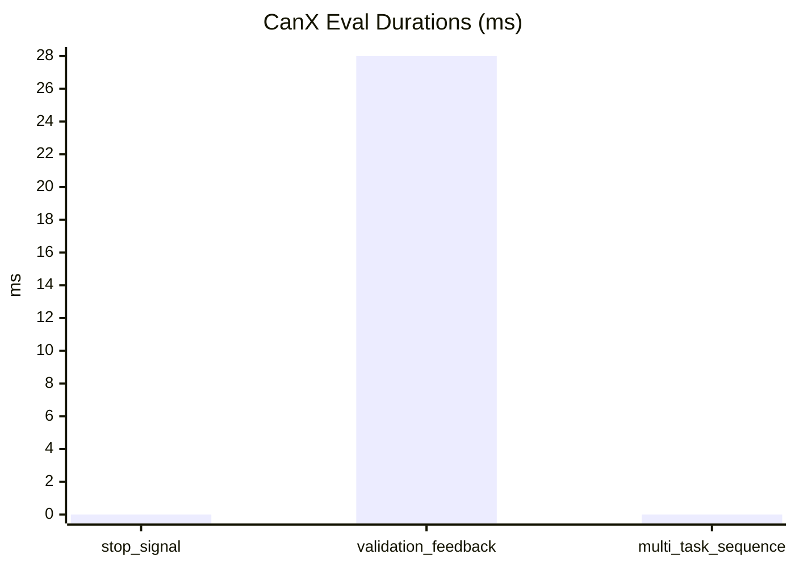

# CanX Eval Report

| Case | Success | Turns | Tasks | Done | Duration (ms) |
| --- | --- | ---: | ---: | ---: | ---: |
| stop_signal | true | 1 | 1 | 1 | 0 |
| validation_feedback | true | 2 | 1 | 1 | 28 |
| multi_task_sequence | true | 2 | 2 | 2 | 0 |

